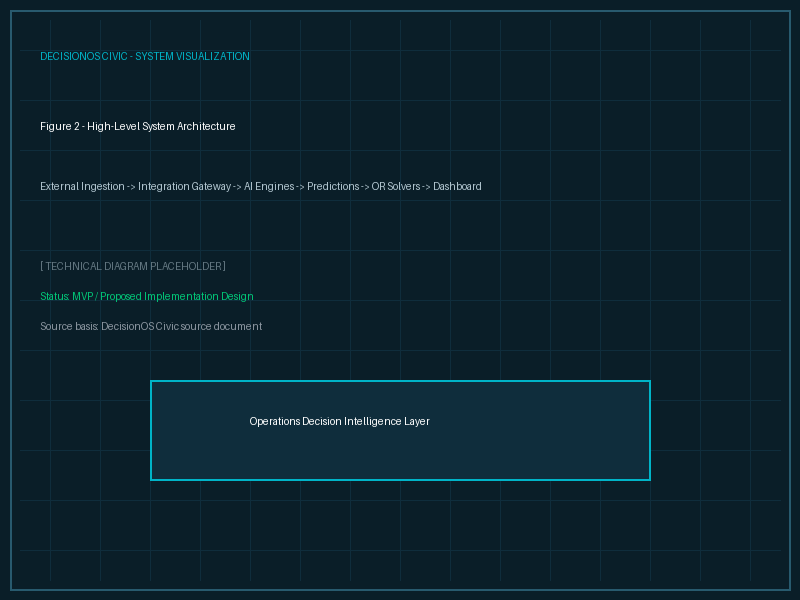

# DecisionOS Civic

## Project Description
**DecisionOS Civic** is an AI-powered Decision Intelligence Platform designed to convert heterogeneous, raw civic information (citizen text complaints, image uploads, GPS coordinates, historical patterns, and weather metrics) into predictive, explainable, and mathematically optimized intervention recommendations for local municipal authorities.

## Project Vision
To transform traditional, reactive civic grievance tracking systems into predictive, proactive, and data-driven administrative tools while maintaining final operational control in the hands of human municipal officers.

## Problem
Conventional grievance portals operate as simple complaint repositories. They are reactive, process duplicates independently, cannot prioritize emergency incidents algorithmically, and fail to optimize resource dispatches under personnel or budget constraints.

## Solution
DecisionOS Civic acts as an **AI Decision Layer** sitting above existing administrative pipelines. It automatically clusters duplicate reports, calculates priority indexes, predicts weather-based hazards (like localized flooding), and solves resource routing problems using Integer Linear Programming.

## Core Capabilities
- **Multimodal AI**: Fine-tuned BERT and YOLOv8 pipeline.
- **Incident Clustering**: Dynamic duplicate grouping.
- **Predictive Risk Mapping**: Forecasts localized environmental events.
- **Integer Linear Programming (ILP)**: Optimizes personnel, vehicle, and budget routing.
- **What-If Simulation**: Administrative sandbox workspace.
- **Explainable AI (XAI)**: SHAP-driven justifications.

## Architecture Overview
The platform processes data from Ingestion -> Data Validation -> AI Engines (NLP/CV/GIS) -> Incident Intelligence -> Prediction -> Operations Optimization -> Dashboard Display.


*Figure 2. High-level architecture showing the flow from civic data sources through AI, prediction, decision intelligence, and human decision-making.*

## Initial Civic Domains
- **Road Damage**: Pothole and road degradation classification.
- **Waste Management**: Collection schedules for overflowing bins.
- **Water Drainage**: Leakage and service failure routing.
- **Flood Risk**: Proactive mitigation routing.

## Technology Stack
- **Frontend**: React, TypeScript, Tailwind CSS, Leaflet.
- **Backend**: Python, FastAPI.
- **Database**: PostgreSQL, PostGIS, Redis.
- **AI/ML**: PyTorch, Hugging Face, OpenCV, XGBoost.
- **Optimization**: Google OR-Tools, PuLP.

## Repository Structure
```
decisionos-civic/
├── docs/                      # Logical documentation folders (01-17)
│   └── PROJECT-MASTER-INDEX.md # Navigation index for the system
├── diagrams/                  # Visual PNG diagrams and models
├── assets/                    # Static image and screenshot assets
├── research/                  # Academic questions and baselines
├── CONTRIBUTING.md            # Contributor guidelines
├── LICENSE                    # MIT license details
└── .gitignore                 # Standard git exclusions
```

## Quick Navigation
To start exploring the documentation:
1. Open the [Project Master Index](docs/PROJECT-MASTER-INDEX.md).
2. Read the [Project Overview](docs/01-overview/01-project-overview.md).
3. Review the [System Architecture](docs/05-architecture/01-system-architecture.md).
4. Review the [Resource Optimization Engine Formulation](docs/06-ai-ml/10-resource-optimization.md).

## Research Focus
The academic core of the project evaluates four questions:
1. Multimodal prediction accuracy vs. text-only baselines.
2. Cosine similarity clustering efficiency for duplicate discovery.
3. Predictive warnings vs. reactive tickets.
4. Linear Programming routing optimization vs. greedy dispatches.

## MVP
The MVP scopes a single-domain (Road Damage) closed-loop pipeline from mobile citizen report to YOLO object detection, severity/priority ranking, and Google OR-Tools dispatch recommendations.

## Future Scope
- Conversational reporting bots (WhatsApp/SMS).
- Automated linkages to live government databases (CPGRAMS/UMANG).
- Real-time IoT drain flow sensors.

## Project Status
- **Status**: Proposed / Conceptual Architecture.
- **Mode A (Academic Prototype)**: Under development (95% feasibility).
- **Mode B (Pilot Integration)**: Proposed future scope (40% feasibility).

## Team Placeholder
*To Be Defined (Refer to docs/14-implementation/06-team-responsibilities.md)*

## License
Licensed under the [MIT License](LICENSE).
