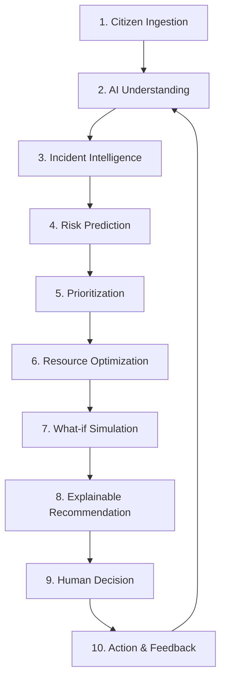

# Project Overview: DecisionOS Civic

## Purpose
This document provides a simple, professional overview of **DecisionOS Civic**. It explains the core concept, the main pipeline, and the civic domains we are covering in our final-year project.

## Content

### Core Concept
DecisionOS Civic is an AI-powered system designed to help local governments and municipal offices manage civic issues—such as potholes, broken streetlights, water leaks, and garbage piles—in a smart, proactive way.

Instead of acting as a simple complaint logbook where citizens register issues and workers manually update status tickets, DecisionOS Civic acts as an **intelligent decision layer**. It uses AI to read complaints, group duplicate reports together, predict localized risks, and recommend the best way to distribute workers and equipment to fix the problems.

---

### The DecisionOS Loop (10-Stage Pipeline)
The system processes information through a simple 10-step loop. Here is how it works in practice when a citizen reports a problem:

1.  **Citizen Ingestion**: A citizen reports a problem (for example, a large pothole) by uploading a photo, typing a description, and tagging their GPS location.
2.  **AI Understanding**: The system's AI reads the description (text processing) and analyzes the photo (image processing) to identify the issue and estimate how bad the damage is.
3.  **Incident Intelligence**: If multiple citizens report the same pothole, the system recognizes they are talking about the same thing and groups them into one "Incident" to prevent sending multiple crews to the same spot.
4.  **Risk Prediction**: The system analyzes historical data and weather trends (like heavy rainfall) to predict future risk levels (such as localized flooding).
5.  **Prioritization**: The system calculates a priority score (how urgent the problem is) based on severity and location. For example, a pothole near a school or hospital gets a higher priority.
6.  **Resource Optimization**: The system looks at available workers, vehicles, and budgets to recommend the best dispatch schedule to resolve the most urgent issues first.
7.  **What-if Simulation**: Administrators can test different options in a sandbox (e.g., "What if we add one more repair team to Zone A?").
8.  **Explainable Recommendation**: The system explains *why* it suggests a specific action (e.g., "Recommend dispatching Crew 1 because they are closest and the pothole is high-priority").
9.  **Human Decision**: A municipal officer reviews the suggestion. The AI only recommends; the human officer has the final say to approve or change the plan.
10. **Action & Feedback**: Field workers resolve the problem. The system logs how long the repair took, helping the AI make better recommendations next time.

---

### Civic Domains Covered

In our project, the system focuses on four main civic areas:

*   **Road Damage**: Detecting and cataloging potholes, road cracks, and broken street surfaces.
*   **Waste Management**: Tracking overflowing garbage bins and illegal waste dumping.
*   **Water Drainage**: Identifying water line leakages, sewer blocks, and open drains.
*   **Flood Risk**: Mapping waterlogging hazards during heavy rainfall.

---
*Source basis: DecisionOS Civic source document*

## Related Documents
- [Executive Summary](02-executive-summary.md)
- [Project Vision](03-project-vision.md)
- [Project Objectives](04-project-objectives.md)
- [Proposed Solution](../03-solution/01-proposed-solution.md)
