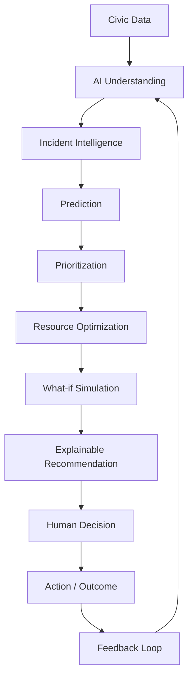

# Project Overview: DecisionOS Civic

## Purpose
This document provides a comprehensive introduction to **DecisionOS Civic**, an AI-powered Decision Intelligence Platform designed to transform raw, heterogeneous civic data into predictive, explainable, and optimized resource allocation recommendations for human decision-makers.

## Content
### Core Concept
DecisionOS Civic acts as an intelligent decision-support layer for local municipal administrations. Rather than functioning as a basic complaint logging and tracking system, it processes citizen reports, environmental feeds, operational logs, and historical records to predict community risks, detect duplicate complaints, prioritize incidents, and optimize field dispatch.

### The DecisionOS Civic Pipeline
The platform implements a continuous information-to-action-feedback loop:

### Initial Civic Domains
1. **Road Damage**: Detection and categorization of potholes, cracks, and road degradation.
2. **Waste Management**: Spotting and scheduling collection for overflowing garbage bins.
3. **Water Drainage**: Identifying leakages, blockages, and service disruptions.
4. **Flood Risk**: Geospatial risk prediction and mitigation routing during monsoon periods.

## Related Documents
- [Executive Summary](02-executive-summary.md)
- [Project Vision](03-project-vision.md)
- [Project Objectives](04-project-objectives.md)
- [System Architecture](../05-architecture/01-system-architecture.md)
