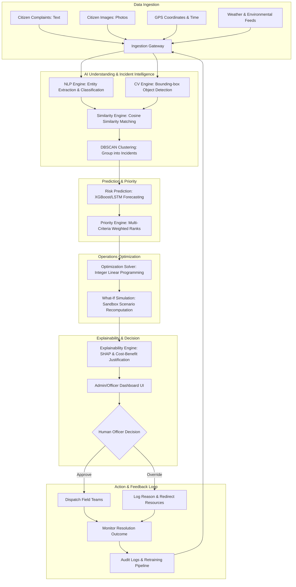

# Project Overview: DecisionOS Civic

## Purpose
This document provides a comprehensive technical overview of **DecisionOS Civic**, an AI-powered Decision Intelligence Platform designed to convert heterogeneous, raw civic data into predictive, explainable, and mathematically optimized resource allocation recommendations for human decision-makers.

## Content

### Core Concept
DecisionOS Civic acts as an intelligent decision-support layer for local municipal administrations. Rather than functioning as a basic complaint logging and tracking system, it processes citizen reports, environmental feeds, operational logs, and historical records to predict community risks, detect duplicate complaints, prioritize incidents, and optimize field dispatch.

### The DecisionOS Civic Pipeline
The platform implements a continuous information-to-action-feedback loop. The diagram below represents the exact flow of data through the platform:

### Detailed Pipeline Stages

1. **Civic Data Ingestion**: Gathers fragmented, unstructured citizen inputs (text description, GPS points, photographs) and merges them with dynamic external feeds (daily rainfall metrics, localized wind speeds, structural maps).
2. **AI Understanding**: 
   * *NLP Subsystem*: Tokenizes complaint text, extracting semantic intent, duration, and urgency tags.
   * *CV Subsystem*: Classifies images, draws bounding boxes around infrastructure faults, and scores visual damage severity.
3. **Incident Intelligence**: Fuses multimodal features (text embeddings, image feature vectors, spatial distance, and time differences) to determine if multiple reports reference the same underlying event, clustering duplicates into a single `Incident` entity.
4. **Prediction**: Analyzes historical databases and environmental forecasts to predict localized risk probabilities (e.g., probability of waterlogging in Zone 3).
5. **Prioritization**: Assigns a numeric priority index (0-100) to each clustered incident based on incident severity, vulnerability index, and exposure parameters.
6. **Resource Optimization**: Models available labor (workers), transit vehicles, and financial limits as mathematical constraints. Runs an Integer Linear Programming (ILP) solver to match active resources to high-priority incidents, maximizing total impact reduction.
7. **What-If Simulation**: Computes alternative operational outcomes inside a sandbox, allowing administrators to preview the impact of varying inputs (e.g., adding 2 crews or adjusting for a 20% rainfall hike).
8. **Explainable Recommendation**: Generates transparent feature-importance breakdowns (SHAP values) and cost-benefit reports explaining why the system chose specific resource dispatches.
9. **Human Decision**: Displays the queue and recommendations to an authorized officer who retains final decision rights (Approve/Override).
10. **Action/Outcome & Feedback Loop**: Executes the approved dispatches, logs overall resolution times, and routes performance data back into the database to retrain the NLP and prioritization weights.

### Initial Civic Domains

| Domain | Visual/Text Target | Primary Risk Model | Optimization Constraints |
|---|---|---|---|
| **Road Damage** | Potholes, cracks, alligator cracking, manhole defects. | Road quality degradation rating over time. | Budget limits, asphalt tons available, worker hours. |
| **Waste Management** | Overflowing garbage bins, illegal dumping, litter piles. | Bin overflow forecasting based on population density. | Waste vehicle capacity, collection route travel times. |
| **Water Drainage** | Pipe leakages, sewer blocks, open sewers. | Recurring blockage alerts. | Department budget limits, pipeline crew counts. |
| **Flood Risk** | Waterlogging, blocked channels, rising water levels. | Weather-based localized inundation probability. | Available water pumps, emergency sandbag supplies. |

---
*Source basis: DecisionOS Civic source document*

## Related Documents
- [Executive Summary](02-executive-summary.md)
- [Project Vision](03-project-vision.md)
- [Project Objectives](04-project-objectives.md)
- [System Architecture](../05-architecture/01-system-architecture.md)
