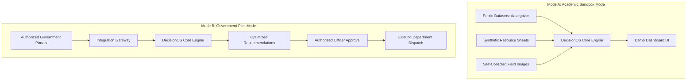

# Executive Summary

## Purpose
This document provides an executive-level summary of the DecisionOS Civic system, detailing its deployment modes, sandbox testing methodology, and structured project feasibility matrices.

## Content

### The Problem
Modern municipal organizations receive hundreds of unstructured, multi-channel reports daily. Traditional tools function as simple databases for registering tickets and manual forwarding. This reactive approach leads to:
*   Redundant field crew dispatches due to duplicate reports (e.g., multiple citizens reporting the same pothole).
*   Inefficient task prioritization, where cosmetic issues may be addressed before critical hazards.
*   Poor resource allocation, failing to solve the complex coordination of personnel, vehicles, and budgets under constraints.

### The Solution
DecisionOS Civic introduces a **Decision Intelligence Layer** above raw municipal systems. It is built to:
1.  **Understand**: Parse citizen text and images concurrently to determine damage severity.
2.  **Consolidate**: Cluster overlapping complaints into a single core incident using geospatial-temporal similarity.
3.  **Predict**: Model localized hazard probabilities before incident reports escalate.
4.  **Optimize**: Dynamically match workers, specialized equipment, and budgets to active incidents using Integer Linear Programming (ILP).
5.  **Explain**: Provide officers with visible justifications (SHAP feature values and travel cost metrics) for all suggested dispatches.

---

### Two-Mode Deployment Strategy
To guarantee feasibility for academic final-year projects and professional pilots without relying on pre-existing government database credentials, DecisionOS Civic operates in two distinct modes:

*   **Mode A (Academic/Demonstration Mode)**: Sourced entirely from public government datasets, self-collected field pictures, and synthetic constraint sheets. Fully functional without institutional partnership.
*   **Mode B (Government Pilot Mode - Future Scope)**: Operates inside municipal networks, consuming complaints from existing portals (like CPGRAMS or UMANG) via the **Integration Gateway**, and sending optimized dispatches back to departmental queues.

---

### Quantitative Feasibility Assessment

The following feasibility matrix details the implementation feasibility score of each system component based on testing and baseline availability:

| System Component | Feasibility Score | Core Technologies | Feasibility Justification |
|---|---|---|---|
| **Web Platform Dashboard** | **95%** | React, TypeScript, Leaflet, Tailwind CSS | Standard web architecture with mature open-source map libraries. |
| **NLP Subsystem** | **90%** | Python, FastAPI, DistilBERT, Transformers | High availability of pre-trained Hugging Face language baselines. |
| **Computer Vision (CV)** | **85%** | PyTorch, YOLOv8, OpenCV | Requires localized model training on pothole/crack datasets. |
| **Duplicate Clustering** | **90%** | Cosine Similarity, DBSCAN | Well-documented mathematical clustering patterns. |
| **GIS Proximity Engine** | **90%** | PostgreSQL, PostGIS, GeoPandas | Mature spatial indexing algorithms (R-tree). |
| **Risk Prediction Engine** | **85%** | XGBoost, LSTM | Time-series forecasting reliant on meteorological datasets. |
| **Optimization Engine** | **85%** | Google OR-Tools, PuLP | Standard Integer Linear Programming (ILP) solver configurations. |
| **Explainable AI (XAI)** | **90%** | SHAP, Feature Weights | Simple linear models facilitate direct explanation tracking. |
| **What-if Simulator** | **80%** | Scenario Comparison Matrices | Involves dynamic recomputations of linear constraints. |
| **Academic Sandbox Setup** | **95%** | Python, Mock Data Generators | Direct mock database instantiation without external dependencies. |
| **Real Government Sync** | **40%** | REST APIs, OAuth2 Gateway | Severely restricted due to institutional authorization hurdles. |

---

### Coimbatore Municipal Sandbox Setup
For prototype verification, the platform initializes a fictional municipal environment:
*   **Target Identifier**: *Coimbatore Municipal Decision Intelligence Sandbox* (Coimbatore Smart Civic Pilot).
*   **Mock Administration Structure**:
    *   **Roads Department**: 3 repair crews, 2 asphalt trucks, ₹2L budget.
    *   **Water Department**: 2 repair teams, 1 tanker, ₹1.5L budget.
    *   **Drainage Department**: 2 crews, 1 excavator, ₹1L budget.
    *   **Waste Management**: 2 trucks, 4 workers, ₹50k budget.
*   **Verification Objective**: Demonstrate how a single pothole report in Zone 4 triggers a YOLOv8 detection, groups with 5 other reports, ranks at 83 priority, and receives an optimized patch crew dispatch in under 3 seconds.

---
*Source basis: DecisionOS Civic source document*

## Related Documents
- [Project Overview](01-project-overview.md)
- [Project Vision](03-project-vision.md)
- [Proposed Solution](../03-solution/01-proposed-solution.md)
- [Development Roadmap](../14-implementation/02-development-roadmap.md)
