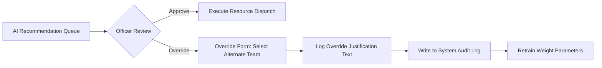

# Project Vision

## Purpose
This document details the long-term vision behind DecisionOS Civic, the operational paradigm shifts it introduces, and the integration of Human-in-the-Loop (HITL) system feedback structures.

## Content

### Strategic Vision Statement
> **"To establish a transparent, predictive, and mathematically optimized decision-support infrastructure that empowers municipal leaders to transition from reactive crisis management to proactive community governance, maximizing the impact of every public resource."**

---

### The Smart City Paradigm Shift
DecisionOS Civic redefines municipal operations across four core areas:

```
[ Reactive Ingestion ] ──► [ Predictive Risk ] ──► [ Proactive Mitigation ] ──► [ Data-Driven Optimization ]
```

1.  **Reactive to Predictive**: Standard systems wait for a citizen to report a failure (e.g., "Road is flooded"). DecisionOS models meteorological trends and historical infrastructure conditions to predict the event *before* it occurs (e.g., "Zone A has an 82% flood probability in the next 24 hours").
2.  **Siloed to Clustered**: Conventional grievance platforms treat 100 individual complaints about a single water leak as 100 distinct tickets. DecisionOS clusters these reports into a single core incident, eliminating administrative clutter.
3.  **Arbitrary to Optimized**: Instead of relying on manual, ad-hoc dispatch choices by supervisors, the platform utilizes mathematical optimization algorithms (Integer Linear Programming) to allocate teams, transit assets, and budgets efficiently.
4.  **Opaque to Explainable**: Recommendations are supported by visible feature-weight explanations (SHAP breakdowns), showing citizens and administrators why certain tasks were prioritized.

---

### Human-in-the-Loop (HITL) Architecture
DecisionOS Civic is strictly designed **not** to automate municipal decision-making or make autonomous executive choices. 

The platform operates as an **advisory and support layer**. All optimization recommendations are pushed to a human supervisor's review queue.

#### The Approve/Override Workflow



1.  **Queue Display**: The officer views a ranked queue of recommendations (e.g., "Deploy Team A to Pothole Incident #RD-1042").
2.  **Justification Verification**: The officer reviews the SHAP values (e.g., "+25 Severity, +20 School Proximity") and travel metrics.
3.  **Action Selection**:
    *   *Approve*: The officer clicks "Approve", automatically sending job orders to the field crews.
    *   *Override*: The officer selects a different crew (e.g., redirecting Team B to the site) and must enter a text justification (e.g., "Team A's asphalt vehicle is undergoing emergency maintenance").
4.  **Logging**: The override decision, original recommendation, and justification text are written to the database.

---

### Feedback and Model Adaptation Loops
DecisionOS implements two closed-loop feedback pathways to improve model accuracy over time:

#### 1. Optimization Speed Calibration Loop
*   *Mechanism*: When a field team marks a task completed, the system logs the actual resolution duration ($T_{\text{actual}}$) and compares it with the solver's predicted duration ($T_{\text{predicted}}$).
*   *Action*: The difference is fed back to update the cost coefficients of the Integer Linear Programming constraint models, refining future dispatch time estimates.

#### 2. Prioritization Weight Calibration Loop
*   *Mechanism*: The system tracks how often officers override the priority queue rankings (e.g., regularly bumping waste cleanup tasks above street light repairs).
*   *Action*: These override patterns are evaluated to dynamically update the priority weight factors:

$$
w_{\text{domain-new}} = (1 - \alpha) \cdot w_{\text{domain-old}} + \alpha \cdot \text{OverrideCorrection}
$$

Where $\alpha$ is the learning rate, ensuring the prioritization engine aligns with localized human expertise.

---
*Source basis: DecisionOS Civic source document*

## Related Documents
- [Project Overview](01-project-overview.md)
- [Project Objectives](04-project-objectives.md)
- [Responsible AI & Human-in-the-loop](../12-security/04-responsible-ai.md)
- [Resource Optimization](../06-ai-ml/10-resource-optimization.md)
