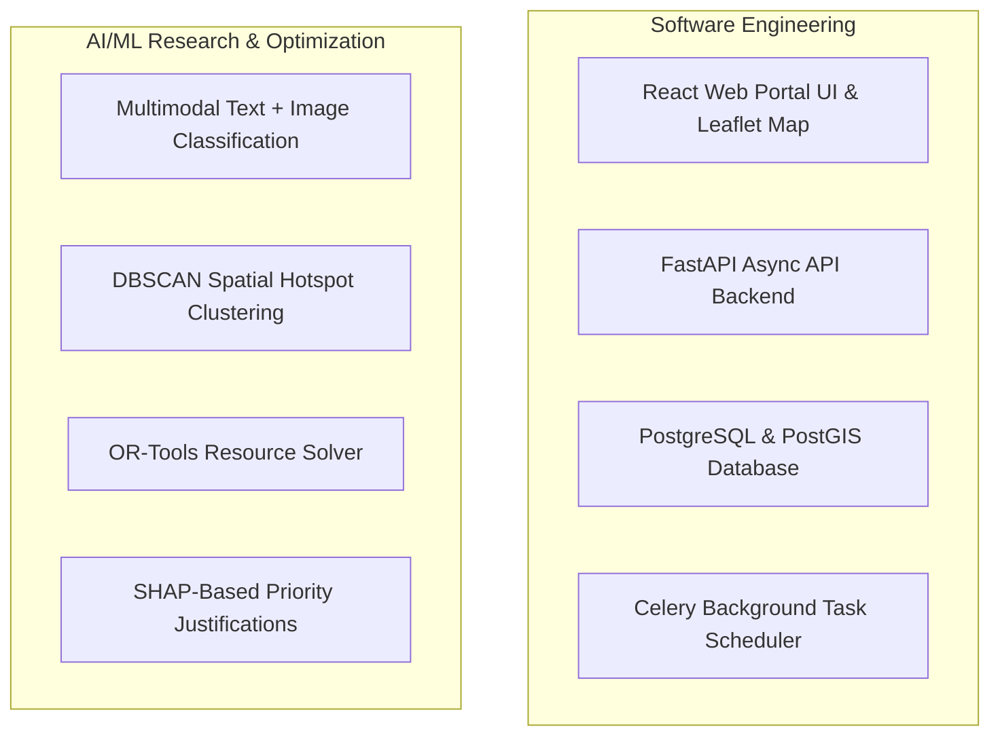

# Project Objectives

## Purpose
This document lists the practical, clear technical objectives for our final-year project development team.

## Content

### Practical Project Objectives

Our team aims to implement the following ten capabilities to demonstrate a working prototype of DecisionOS Civic:

1.  **Intelligent Civic Issue Understanding**: Build an NLP model that reads citizen complaint text and automatically extracts the category (e.g., Water Leakage), duration, and urgency tags.
2.  **Multimodal Civic Analysis**: Create a processing pipeline that combines the complaint description and the uploaded photo to assess the problem.
3.  **Duplicate Incident Detection**: Create a simple similarity matcher that checks if newly submitted complaints are within a 120-meter radius of an active issue and describe the same problem, grouping them together.
4.  **Civic Severity Prediction**: Classify the severity of an incident (Low, Medium, High, Critical) based on the image, the category, and location factors.
5.  **Predictive Civic Risk**: Build a forecasting module that calculates localized environmental risk (such as waterlogging probability) using historical occurrences and daily rainfall data.
6.  **Civic Hotspot Detection**: Implement a spatial clustering map (using standard algorithms like DBSCAN) to highlight areas on the city map where complaints are heavily concentrated.
7.  **Intelligent Prioritization**: Rank active incidents dynamically in a queue based on how urgent they are (e.g., flooding near a hospital is placed at the top).
8.  **Resource Allocation Optimization**: Build a scheduling calculator (using tools like Google OR-Tools) to recommend which available workers and vehicles should be sent to resolve the prioritized incidents first.
9.  **What-If Simulation**: Create a simple sandbox page where the administrator can adjust sliders (e.g., adding extra teams or simulating heavy rain) to see how it affects resolution times.
10. **Explainable AI**: Show clear, plain-language text reasons (e.g., "+25 Urgency due to School Proximity") explaining why specific actions are prioritized.

---

### Project Scope Boundaries

To organize our workflow, our project is divided into Software Engineering tasks and AI/ML Research tasks:

---
*Source basis: DecisionOS Civic source document*

## Related Documents
- [Project Overview](01-project-overview.md)
- [Research Focus](../13-research/01-research-overview.md)
- [Technology Stack](../14-implementation/01-technology-stack.md)
- [MVP Scope](../14-implementation/03-mvp-scope.md)
