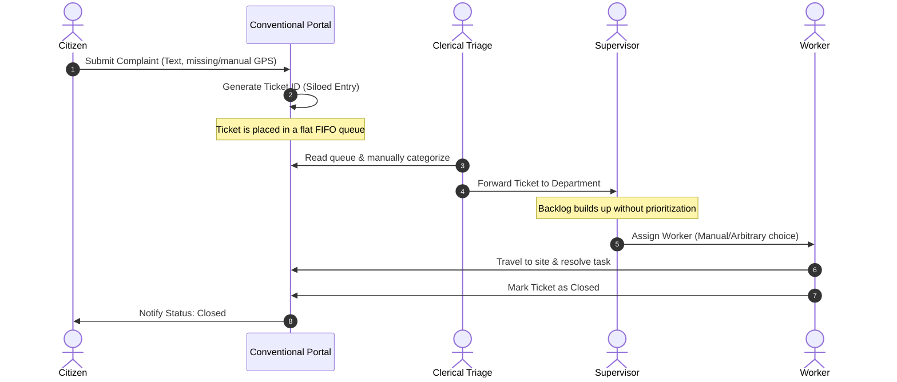

# Existing System

## Purpose
This document conducts a technical analysis of conventional civic grievance-management systems, their workflows, and their core relational database limitations.

## Content

### Conventional Grievance Workflow
Conventional grievance platforms function primarily as simple ticket-routing forms. The typical lifecycle of a complaint in these systems follows a rigid, linear sequence:

1.  **Citizen Submission**: A citizen submits a ticket containing a text description. Coordinates are often missing, inaccurate, or entered as string text (e.g., "near bus stand").
2.  **Ticket Registration**: The system assigns a unique ticket ID and stores the record in a flat relational table.
3.  **Manual Triage**: A clerical administrator reviews the ticket queue, reads the description, and manually routes it to a target department (e.g., Water Department).
4.  **Ad-Hoc Supervisor Allocation**: The department supervisor manually reviews their queue and assigns the task to a worker, often based on proximity to the worker's home base or convenience rather than overall resource efficiency.
5.  **Manual Resolution**: The field worker travels to the site, performs the repairs, and manually marks the ticket as closed.

---

### Process Lifecycle Sequence

The diagram below tracks a complaint's lifecycle, illustrating the manual bottlenecks and delays present in conventional platforms:



---

### Database Schema Limitations
In conventional systems, the database model is flat and lacks spatial-temporal awareness. 

#### typical Relational Schema
```sql
CREATE TABLE complaints (
    id SERIAL PRIMARY KEY,
    citizen_name VARCHAR(100),
    description TEXT,
    address_text VARCHAR(255),
    status VARCHAR(50), -- 'Open', 'Pending', 'Closed'
    created_at TIMESTAMP,
    closed_at TIMESTAMP
);
```

#### Core Database Limitations:
1.  **Lack of Spatial Indexing**: Location is stored as unstructured text (`address_text`) rather than PostGIS geometry points. This prevents R-tree indexing and bounding-box queries, making it impossible to perform automated proximity checks.
2.  **No Clustering Support**: Every row is treated as an independent ticket. There are no relational mappings (`IncidentReports`) to cluster duplicate reports together.
3.  **No Resource Constraints**: The database does not model available personnel, vehicle types, travel distances, or budgets. Optimization solvers cannot be connected because the necessary mathematical parameters do not exist in the schema.

---
*Source basis: DecisionOS Civic source document*

## Related Documents
- [Problem Statement](01-problem-statement.md)
- [Limitations of Existing Systems](03-existing-system-limitations.md)
- [Database Model](../10-database/02-data-model.md)
