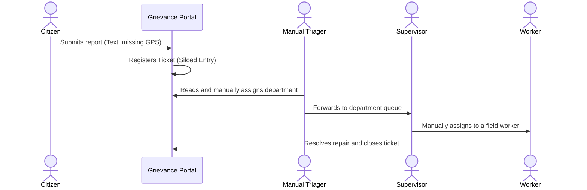

# Existing System

## Purpose
This document explains how current grievance-tracking portals work, their manual steps, and their basic database limits.

## Content

### How Current Systems Work
Most municipal complaints applications used today are basic digital forms. The typical process is:

1.  **Citizen Reports**: A citizen types a complaint (e.g., "pothole on Main Road"). Often, exact GPS coordinates are missing or typed manually as text (e.g., "opposite the bus stand").
2.  **Complaint Registered**: The ticket is saved in the database with a status of "Open".
3.  **Manual Routing**: A clerk has to read the ticket description and decide which department should handle it (e.g., forwarding it to the Roads Department).
4.  **Worker Assigned**: The department supervisor manually selects a field worker and assigns the task.
5.  **Resolution**: The worker travels to the site, fixes the problem, and marks the ticket as closed.

---

### Database Limitations of Current Systems
Current databases are structured like simple spreadsheets:
*   **No Location Intelligence**: Location is stored as simple text (like "12th street"). Since it is not stored as coordinate points, the database cannot calculate distances or search for nearby reports automatically.
*   **Treats Every Report Separately**: There is no logical link to group reports together. If 10 citizens report the same leak, the database stores 10 separate rows, leading to duplicate work.
*   **No Resource Management**: The system does not store details about available tools, crew capacities, or travel distances, making it impossible to schedule work automatically.

---
*Source basis: DecisionOS Civic source document*

## Related Documents
- [Problem Statement](01-problem-statement.md)
- [Limitations of Existing Systems](03-existing-system-limitations.md)
- [Database Model](../10-database/02-data-model.md)
