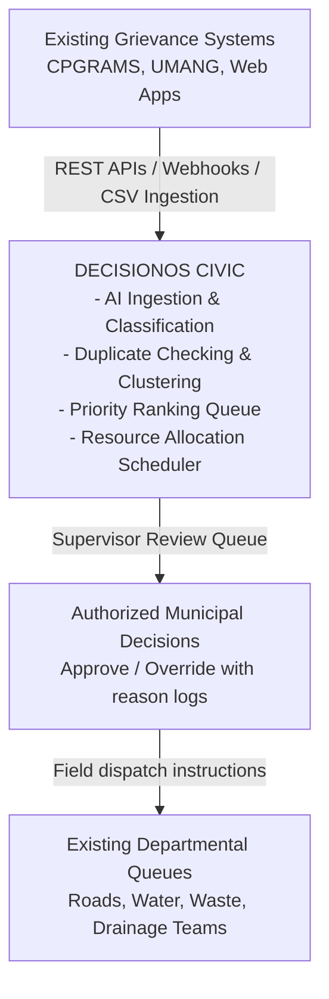

# Proposed Solution: DecisionOS Civic

## Purpose
This document presents the architecture and core software layers of **DecisionOS Civic** as a decision-support system.

## Content

### Sits-Above Integration Layer
DecisionOS Civic is not designed to replace existing municipal portals. Instead, it is built as an **intelligent middleware layer** that sits above existing databases and complaint tools:

---

### Core Software Stack
Our project is built using a modern, decoupled stack:

1.  **Frontend (Web UI)**: Built with **React** and **TypeScript**. We use **Leaflet** maps to display complaints, hotspots, and vehicle routes.
2.  **Backend (API)**: Built with **FastAPI** (Python). This handles JWT login security, database queries, and simulator runs.
3.  **Task Scheduler**: We use **Celery** with **Redis** to run heavy computations (like vision processing and scheduling calculations) in the background, keeping the web page fast and responsive.
4.  **Database**: **PostgreSQL** with the **PostGIS** extension to support map-based spatial queries and proximity matching.

---
*Source basis: DecisionOS Civic source document*

## Related Documents
- [Core Concept](02-core-concept.md)
- [How DecisionOS Works](03-how-decisionos-works.md)
- [Key Differentiators](04-key-differentiators.md)
- [System Architecture](../05-architecture/01-system-architecture.md)
- [Layered Architecture](../05-architecture/02-layered-architecture.md)
