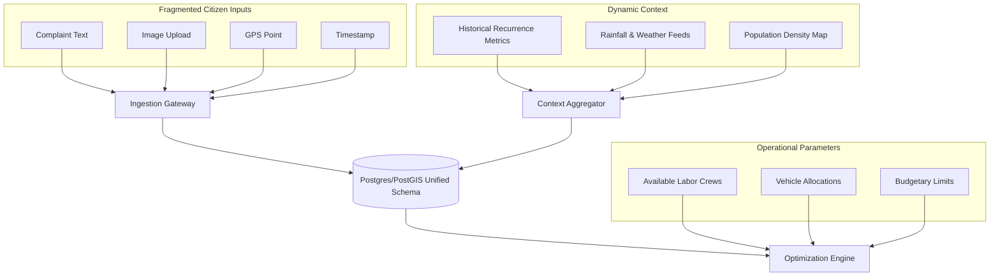

# Core Concept

## Purpose
This document explains the core conceptual model of DecisionOS Civic, detailing the integration of heterogeneous inputs and system constraints.

## Content

### Unified Data Ingestion Model
DecisionOS Civic acts as a data aggregator. Rather than routing raw citizen text tickets directly to department workers, the platform fuses multiple input signals into a unified data structure before running models.

---

### Structural Inputs & Parameters
The database ingests and maps two distinct categories of parameters to generate optimal dispatch recommendations:

#### 1. Ingestion parameters (Citizen complaints & Context)
*   **Text Descriptions**: Standardized to extract semantic categories (e.g., `Road Damage`) and urgency indicators.
*   **Photographs**: Passed to object detection pipelines to confirm reports and calculate severity index ratings (0-100).
*   **Geospatial (Latitude/Longitude)**: Placed in a PostGIS geometry coordinate field (`geom`) to allow spatial checks and duplicate clustering.
*   **Meteorological & Demographic feeds**: Track daily precipitation rates and regional census population counts.

#### 2. Constraints & Resources (Municipal variables)
*   **Crew Lists**: Tracking the count and availability of specialized work teams.
*   **Vehicle Assets**: Counting dump trucks, patchers, and excavators.
*   **Department Budget Limits**: Absolute financial ceiling for materials (e.g., asphalt tons) and overtime labor.
*   **Historical Log Database**: Tracking previous incident resolution durations to calibrate mathematical constraints.

---

### Concept Illustration Reference
The high-level relationship between these components is mapped in the conceptual illustration:

*Figure 1. High-level concept showing the transformation of raw complaints and environmental metrics into explainable recommendations for authorities.*

---
*Source basis: DecisionOS Civic source document*

## Related Documents
- [Proposed Solution](01-proposed-solution.md)
- [How DecisionOS Works](03-how-decisionos-works.md)
- [Database Model](../10-database/02-data-model.md)
- [Data Strategy](../07-data/01-data-strategy.md)
