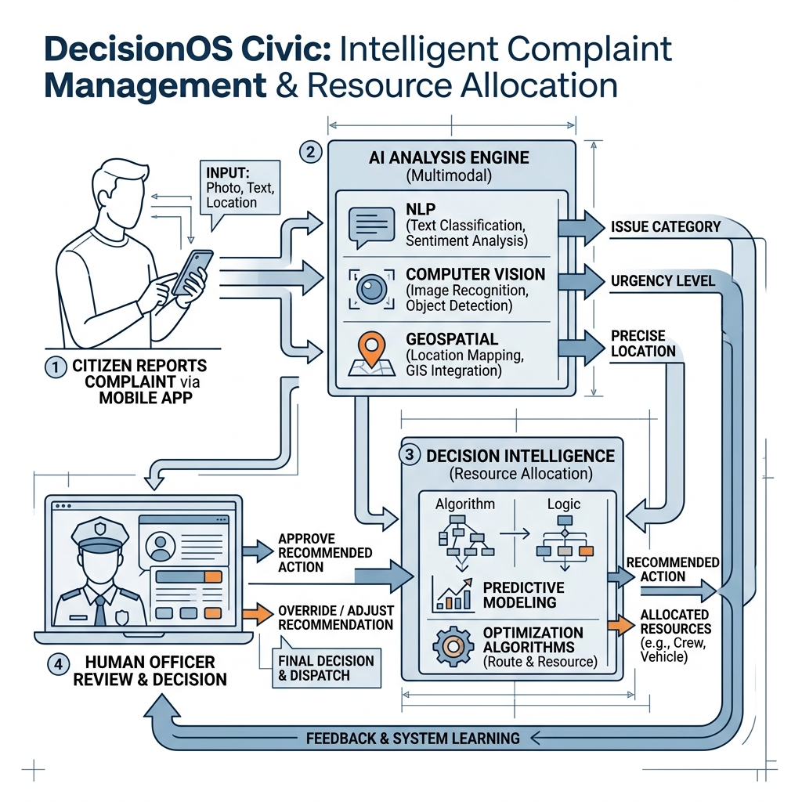

# Core Concept

## Purpose
This document defines the core conceptual foundation of DecisionOS Civic.

## Content
### Platform Integration Concept
The platform continuously integrates heterogeneous signals:
- **Citizen Complaints (Text)**
- **Citizen Images (Photos of damage)**
- **Geographical Data (GPS/Coordinates)**
- **Historical Incidents (Recurrence metrics)**
- **Environmental Data (Rainfall, temperature)**
- **Operational Data (Available workers, vehicles)**
- **Resource Constraints (Budgets, working hours)**

### High-Level Visual

*Figure 1. High-level concept showing the transformation of raw complaints and environmental metrics into explainable recommendations for authorities.*

## Related Documents
- [Proposed Solution](01-proposed-solution.md)
- [How DecisionOS Works](03-how-decisionos-works.md)
