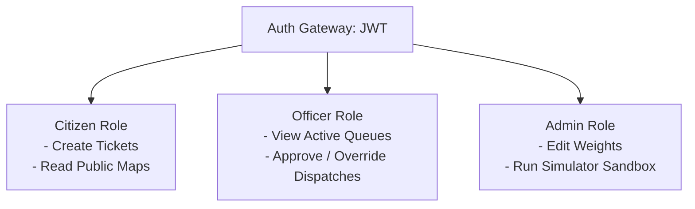

# Non-Functional Requirements

## Purpose
This document details the non-functional requirements (NFRs) of DecisionOS Civic, outlining performance, security, and scalability constraints.

## Content

### Technical Performance Metrics
The system must maintain high responsiveness even under peak complaint loads:
*   **API Response Latency**: The FastAPI endpoint `/api/v1/complaints` must return a tracking ID in less than **200ms** (excluding image upload time).
*   **AI Inference Duration**:
    *   NLP classification and entity extraction must complete within **500ms**.
    *   YOLOv8 object detection and severity scoring must complete within **2.0 seconds** of image upload.
*   **Optimization Solver Runtime**: The Integer Linear Programming (ILP) solver in Google OR-Tools must find an optimal dispatch schedule in less than **3.0 seconds** for 100 active incidents.
*   **System Throughput**: The API layer must handle up to **100 concurrent requests/second** without dropped connections.

---

### Security & Role-Based Access Control (RBAC)

To protect sensitive citizen data and municipal systems, the platform enforces strict authentication boundaries:

#### Authorization Matrix

| Operations / Features | Citizen (Anonymous) | Field Worker | Municipal Officer | System Administrator |
|---|---|---|---|---|
| **Create Complaint** | Yes | Yes | Yes | Yes |
| **View Incident Queue** | No | No | Yes | Yes |
| **Approve / Override dispatches** | No | No | Yes | Yes |
| **Adjust Solver Weights** | No | No | No | Yes |
| **Run What-if Simulator** | No | No | No | Yes |
| **Modify User Roles** | No | No | No | Yes |

*   **Authentication Mechanism**: JSON Web Tokens (JWT) with HMAC-SHA256 signatures. Token lifespan is set to 8 hours.
*   **Network Encryption**: E2E TLS 1.3 encryption (HTTPS/WSS) for all web socket and API endpoints.

---

### High-Availability & Scalability
*   **Horizontal Scalability**: The system must utilize containerized workers. FastAPI gateways and Celery AI workers can scale out horizontally during monsoons or emergency events.
*   **Spatial Database Tuning**: The PostgreSQL/PostGIS instance must implement R-tree spatial indexing on all coordinate columns (`geom`). Search queries for duplicate checks must remain sub-second up to 100,000 active points.
*   **Message Broker Isolation**: Redis must run in a dedicated, cached memory container to isolate Celery task orchestration queues from DB connection limits.

---
*Source basis: DecisionOS Civic source document*

## Related Documents
- [Functional Requirements](01-functional-requirements.md)
- [User Requirements](03-user-requirements.md)
- [System Requirements](04-system-requirements.md)
- [Authentication API](../11-api/02-authentication.md)
