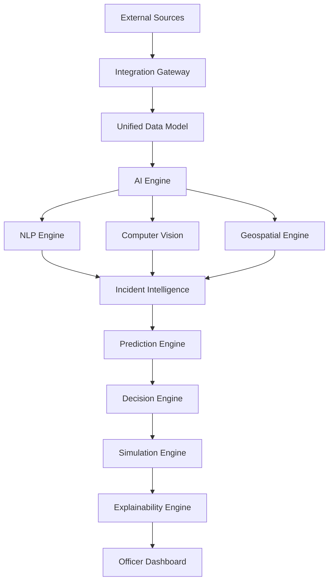

# System Architecture

## Purpose
This document details the high-level system architecture of DecisionOS Civic.

## Content
### Architectural Overview
DecisionOS Civic is structured to handle data ingestion, AI inference, and optimization in a decoupled pipeline.

*Figure 2. High-level architecture showing the flow from civic data sources through AI, prediction, decision intelligence, and human decision-making.*

### System Flow

## Related Documents
- [Layered Architecture](02-layered-architecture.md)
- [Data Flow](03-data-flow.md)
