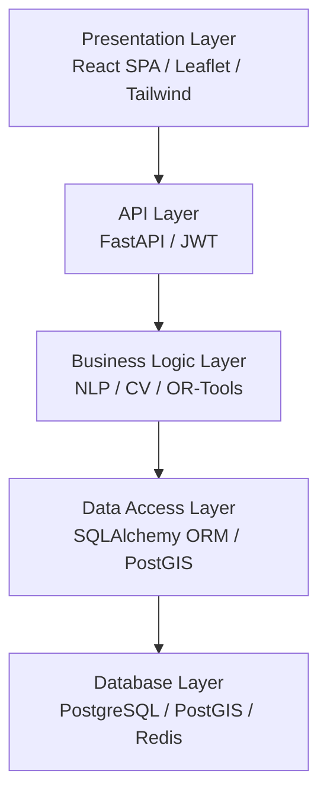

# Layered Architecture

## Purpose
This document describes the layered software architecture of DecisionOS Civic.

## Content
### Architectural Layers

### Decoupling Strategy
AI and Optimization tasks are computationally heavy. The API layer (FastAPI) routes tasks to asynchronous Celery workers backed by Redis, protecting API responsiveness.

## Related Documents
- [System Architecture](01-system-architecture.md)
- [Technology Stack](../14-implementation/01-technology-stack.md)
