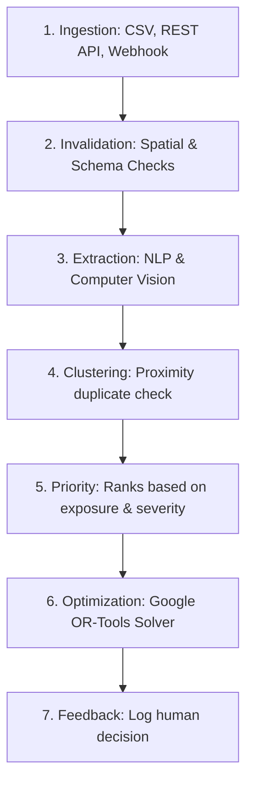
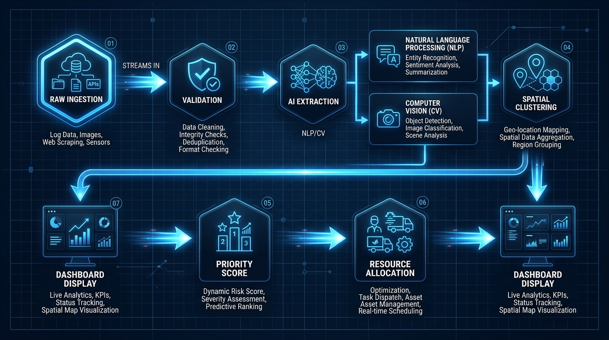

# Data Flow

## Purpose
This document tracks the flow of data through DecisionOS Civic from ingestion to dashboard display.

## Content
### Ingestion to Recommendation Data Flow
1. **Ingestion**: Raw complaints arrive via CSV uploads, REST APIs, or webhook triggers.
2. **Validation**: The gateway filters out empty files or complaints outside municipal boundaries.
3. **Feature Extraction**: NLP classifies text category, and Computer Vision detects potholes/cracks in photos.
4. **Duplicate Clustering**: The similarity engine checks if the complaint coordinates overlap with an active incident and merges them if they match.
5. **Priority Scoring**: Ranks incidents dynamically based on severity, population exposure, and vulnerability.
6. **Resource Optimization**: Google OR-Tools schedules worker dispatches to resolve prioritized incidents.
7. **Feedback Log**: Human decisions are saved, closing the loop.

*Figure 3. Unified data flow diagram showing raw data ingestion, processing, modeling, and output routing.*

## Related Documents
- [System Architecture](01-system-architecture.md)
- [API Overview](../11-api/01-api-overview.md)
