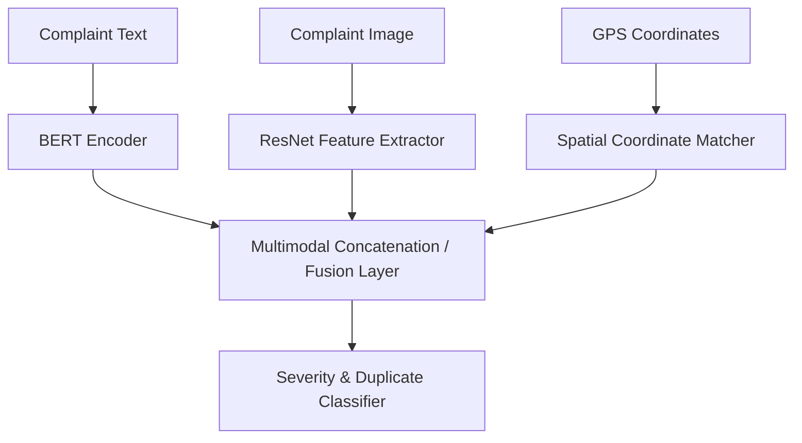

# AI Architecture

## Purpose
This document details the machine learning architecture.

## Content
### Multimodal AI Fusion Model
DecisionOS Civic fuses text, image, and spatial signals.

### Model Registry
- **NLP Models**: Fine-tuned DistilBERT models.
- **Vision Models**: YOLOv8 for bounding-box detection, EfficientNet for severity.
- **Similarity Model**: Sentence-transformers (all-MiniLM-L6-v2) for cosine similarity.

## Related Documents
- [AI/ML Overview](../06-ai-ml/01-ai-ml-overview.md)
- [Multimodal Intelligence](../06-ai-ml/04-multimodal-intelligence.md)
