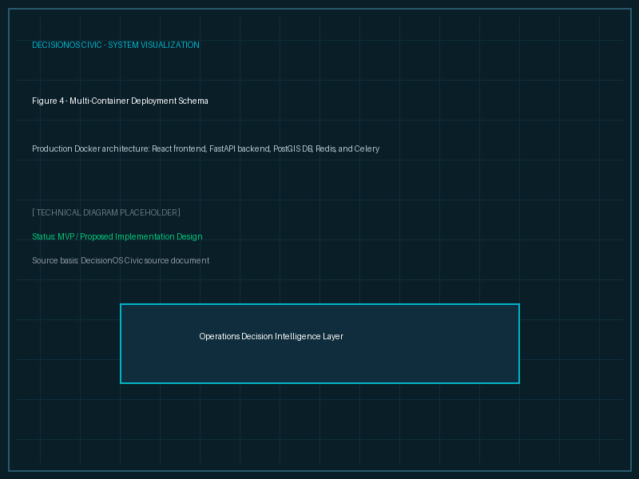

# Deployment Architecture

## Purpose
This document describes the deployment architecture and container layout.

## Content
### Deployment Scheme (Status: Proposed)
The system is built to deploy on Docker container engines.

*Figure 4. Proposed multi-container deployment architecture using Docker and Nginx.*

### Container Services
- **nginx**: Acts as the reverse proxy.
- **frontend**: Hosts the compiled React app.
- **api-backend**: FastAPI web server container.
- **celery-worker**: Background worker running PyTorch and optimization code.
- **redis**: Task queue and caching layer.
- **db-postgis**: PostgreSQL database container with PostGIS enabled.

## Related Documents
- [Technology Stack](../14-implementation/01-technology-stack.md)
- [System Requirements](../04-requirements/04-system-requirements.md)
