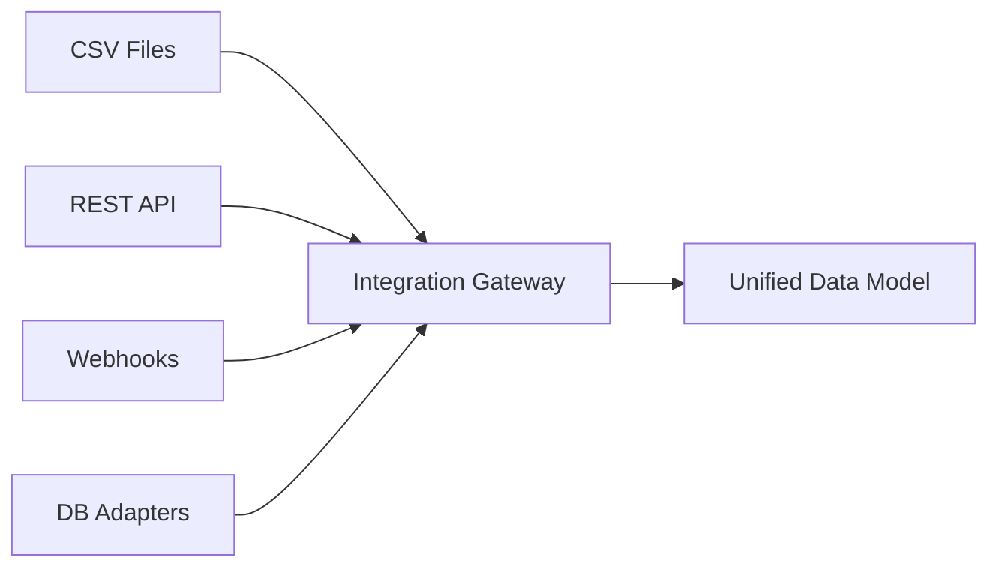

# Integration Architecture

## Purpose
This document explains how DecisionOS Civic integrates with external government databases and third-party APIs.

## Content
### Integration Gateway
The gateway sits at the entry point of the network and abstracts integration formats:

This allows the platform to remain system-agnostic. Municipalities can upload simple CSV dumps (e.g., `complaints.csv`) if they do not support live API synchronization.

## Related Documents
- [Government Integration](../15-integration/01-government-integration.md)
- [Integration Gateway](../15-integration/02-integration-gateway.md)
