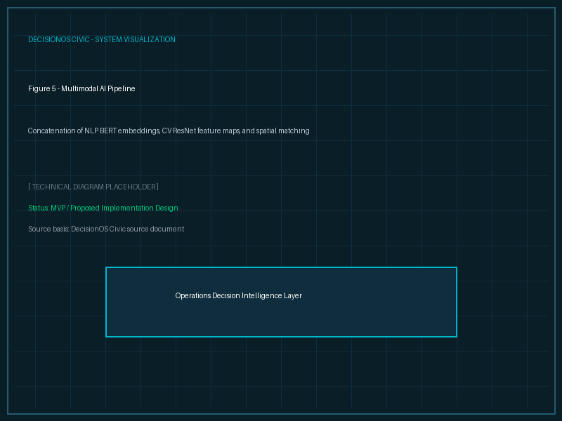

# AI/ML Overview

## Purpose
This document summarizes the artificial intelligence modules integrated into DecisionOS Civic.

## Content
### Core AI Modules
1. **NLP Intelligence**: Fine-tuned transformer models to categorize and extract parameters from complaints.
2. **Computer Vision**: Object detection pipelines for identifying infrastructure damage.
3. **Multimodal Similarity**: Fusion of text, image, and spatial distances for duplicate detection.
4. **Time-Series / Geospatial Forecasting**: Risk mapping using historical trend analysis.
5. **Optimization Solvers**: Operations Research (OR) models for resource constraints.
6. **XAI Models**: SHAP and local explanation modules.

*Figure 5. Overview of the multimodal AI pipeline, fusing text, image, and spatial attributes.*

## Related Documents
- [AI Architecture](../05-architecture/04-ai-architecture.md)
- [NLP Intelligence](02-nlp-intelligence.md)
- [Computer Vision](03-computer-vision.md)
