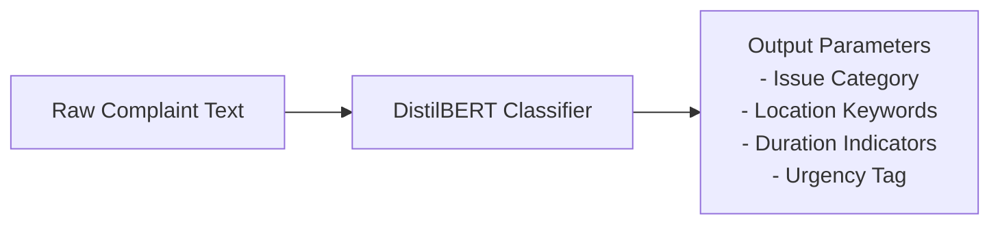

# NLP Intelligence

## Purpose
This document details the NLP engine used to classify text complaints and extract metadata.

## Content
### Pipeline Details
- **Model**: DistilBERT (or BERT baseline).
- **Tasks**:
  1. Multiclass Classification (Grievance category: Waste, Roads, Drainage, etc.).
  2. Entity Extraction (Location indicators, durations, affected groups).

### Text Classification Pipeline

### Example Input/Output
- **Input**: *"Water has been leaking continuously near the bus stand for three days."*
- **Output**:
  - `Category`: `Water Leakage`
  - `Duration`: `3 days`
  - `Location`: `Bus Stand`
  - `Urgency`: `High`

## Related Documents
- [AI/ML Overview](01-ai-ml-overview.md)
- [Multimodal Intelligence](04-multimodal-intelligence.md)
