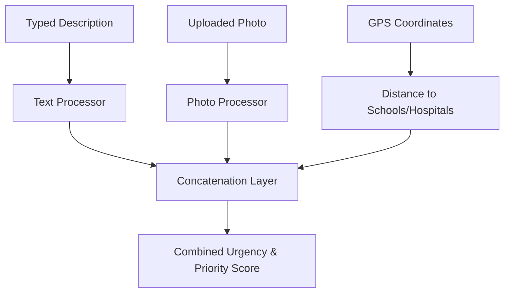

# Multimodal Intelligence

## Purpose
This document details how text, image, and location signals are fused in DecisionOS Civic.

## Content
### Multimodal Fusion Strategy
Instead of running text and images in isolation, the system combines them to get a complete picture:
1. **Text Processing**: Converts the citizen's description into a semantic representation.
2. **Image Processing**: Extracts visual damage features from the photo.
3. **Location Context**: Calculates the distance from schools, hospitals, and critical assets.
4. **Combined Scoring**: The system merges these three signals to determine the true priority score.

### Advantage
Fusing signals prevents misclassification (e.g., a text saying "road is bad" might look low severity, but the image showing a huge crater raises the combined rating to High).

## Related Documents
- [AI Architecture](../05-architecture/04-ai-architecture.md)
- [Duplicate Detection](05-duplicate-detection.md)
