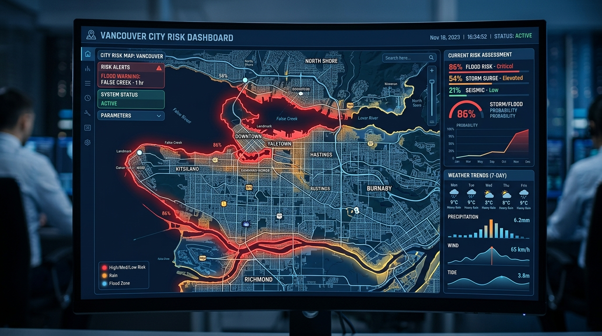

# Predictive Civic Risk

## Purpose
This document details the predictive risk modules in DecisionOS Civic.

## Content
### The Predictive Paradigm
Rather than waiting for citizen complaints, DecisionOS predicts risk:
> *"Area X has an 82% probability of experiencing flooding under current environmental conditions."*

### Model Architecture
- **Baseline**: Random Forest / XGBoost.
- **Advanced**: LSTM / Time-series forecasting models.
- **Features**: Historical incidents, rainfall predictions, drainage capacity, elevation, land usage, population density, current water levels.

*Figure 6. Conceptual dashboard visualization of localized civic risk prediction.*

## Related Documents
- [AI/ML Overview](01-ai-ml-overview.md)
- [What-if Simulation](12-what-if-simulation.md)
