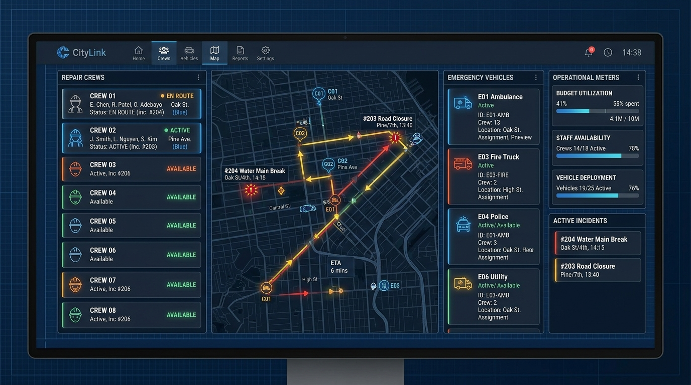

# Resource Optimization

## Purpose
This document presents the mathematical model for resource allocation.

## Content
### Operational Optimization
The resource optimization engine schedules workers, vehicles, and budgets to get the most work done. It takes three key inputs:
1.  **Active Incidents**: Sorted by priority score.
2.  **Available Resources**: Personnel counts, vehicles, and department budget limits.
3.  **Operational Constraints**: Maximum working hours, material limits, and travel times.

Then, it runs a solver (using Google OR-Tools) to recommend which crew should be dispatched to which incident to maximize community impact while staying within our resource limits.

### Implementation Strategy
We utilize **Google OR-Tools** to solve this resource scheduling formulation and compare its execution performance against a simple greedy baseline.

*Figure 7. Optimization dashboard illustrating resource constraints and optimal team allocation output.*

## Related Documents
- [Priority Engine](09-priority-engine.md)
- [Experimental Design](../13-research/04-experimental-design.md)
