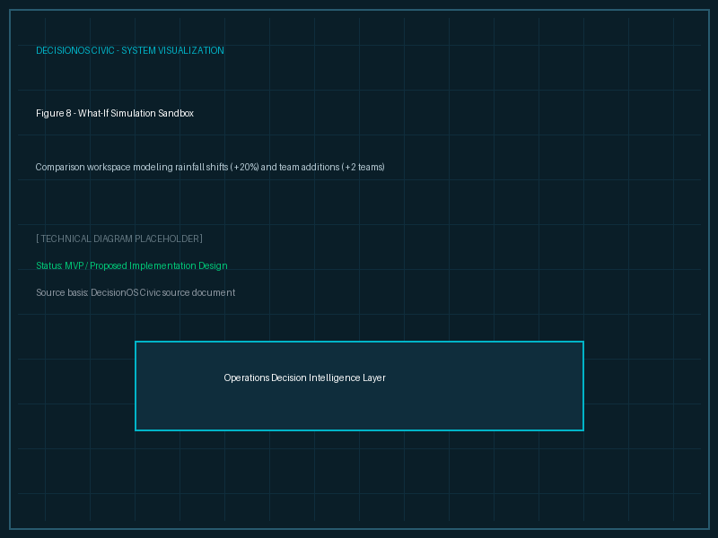

# What-If Simulation

## Purpose
This document explains the simulation sandbox capability.

## Content
### Simulator Sandbox Concept
Administrators can modify system parameters to preview operational outcomes before dispatching teams.

#### Adjustable Variables
- **Environmental**: Rainfall increase percentage (+20%).
- **Resources**: Personnel count (+2 workers), Vehicle count (+1 truck).
- **Budget**: Financial ceiling modification (-10% budget).

### Scenario Comparison
The simulation engine recomputes priorities and constraints:

| Metric | Current Scenario | Proposed Simulation Scenario |
|---|---|---|
| **Rainfall** | Baseline | +20% |
| **Active Teams** | 3 Teams | 4 Teams |
| **Predicted Risk** | 72% | 51% |
| **Resolution Time**| 4.8 Days | 2.7 Days |
| **Cost** | ₹5.2L | ₹5.8L |
| **Resolved Impact**| 100% | 72% (due to rainfall complexity) |

*Figure 8. Simulation comparison workspace showing current vs proposed scenarios.*

## Related Documents
- [Predictive Civic Risk](07-risk-prediction.md)
- [Resource Optimization](10-resource-optimization.md)
