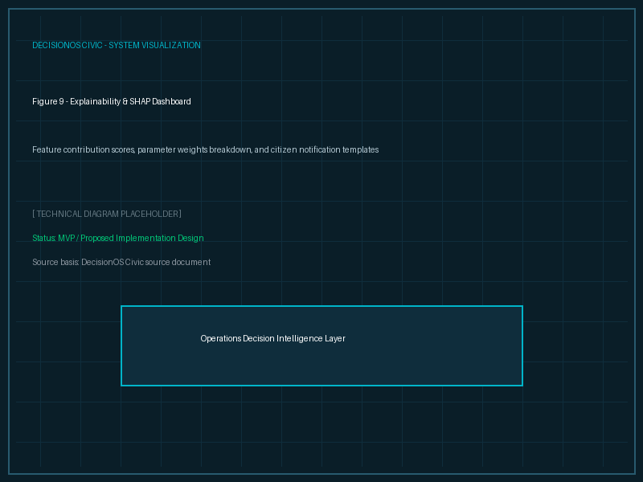

# Explainable AI (XAI)

## Purpose
This document details the explainability interfaces of DecisionOS Civic.

## Content
### Why Explanations Matter
For municipal authorities, black-box recommendations are unusable. Decisions must be transparent and auditable.

### ML Predictions (SHAP Features)
For priority scores, the system displays feature contributions:
- **Priority Score**: 92/100
- **Breakdown**:
  - `+25` High Severity (Object detection)
  - `+20` Population Exposure (Nearby hospital)
  - `+18` Recurring Incident (3 reports this month)
  - `+15` Near Critical Infrastructure
  - `+08` Recent Rainfall
  - `+06` Historical Risk

### Citizen Explanations
Citizens receive clear plain-text notifications:
> *"Your complaint was merged with Incident #CIV-1024 because the reports are within 120 meters and describe similar road damage."*

*Figure 9. Explainability interface detailing priority score contributions and optimization reasoning.*

## Related Documents
- [Priority Engine](09-priority-engine.md)
- [Responsible AI](../12-security/04-responsible-ai.md)
