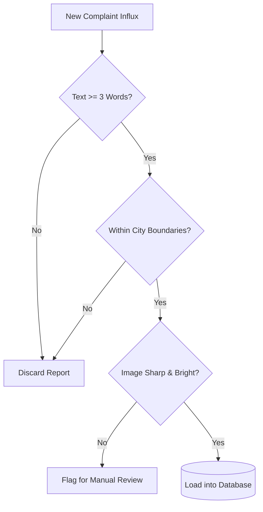

# Data Quality

## Purpose
This document sets standards for monitoring and maintaining data quality.

## Content
### Quality Controls
- **Image Filter**: Drop pictures with extremely low contrast or resolution.
- **GPS Drift Checker**: Flag reports with coordinates placed outside regional municipal bounds.
- **Text Anomaly Filter**: Discard complaints containing fewer than 3 words.

### Quality Control Pipeline

## Related Documents
- [Data Strategy](01-data-strategy.md)
- [Dataset Requirements](03-dataset-requirements.md)
