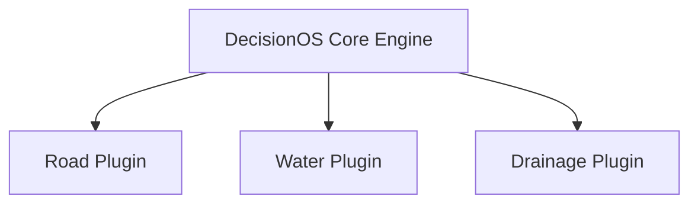

# Domain Overview

## Purpose
This document outlines the initial operational domains supported by DecisionOS Civic.

## Content
### Modularity & Plugins
The core engine is domain-agnostic. Specific domains are supported through **Plugins**.

Each plugin provides:
- Bounding-box classes for CV.
- Custom optimization constraints.
- Custom classification rules.

## Related Documents
- [Road Damage](02-road-damage.md)
- [Proposed Solution](../03-solution/01-proposed-solution.md)
