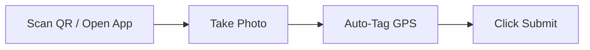

# Citizen Workflow

## Purpose
This document details the user workflow for citizens submitting reports.

## Content
### Reporting Flow
1. **Access Web App**: Visit `decisionos.in/report` (or scan local QR codes placed at community centers).
2. **Upload Evidence**: Take or upload a photo of the incident.
3. **Add Text & Coordinates**: Fill out details; GPS coordinates are tagged automatically.
4. **Submit**: Click submit. A tracking token is generated.

## Related Documents
- [User Roles](01-user-roles.md)
- [Complaint API](../11-api/03-complaint-api.md)
