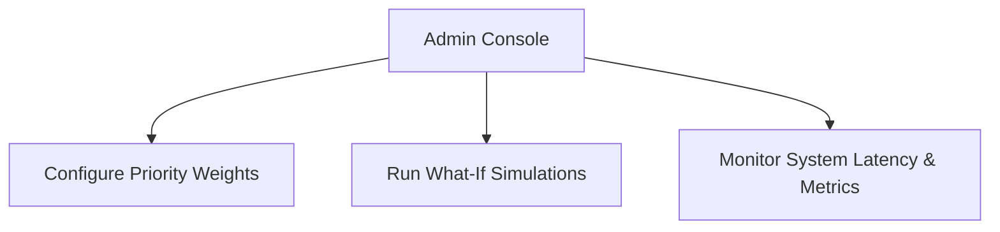

# Administrator Workflow

## Purpose
This document details configuration workflows for system administrators.

## Content
### Administrative Operations
- **Configure Optimization Weights**: Modify the significance values in the priority formulas.
- **Run Simulations**: Adjust variables (e.g., rainfall, budget limits) to forecast city-wide needs.
- **Review System Metrics**: Monitor API latency, model performance, and dispatch effectiveness.

### Administrative Dashboard Actions

## Related Documents
- [User Roles](01-user-roles.md)
- [What-if Simulation](../06-ai-ml/12-what-if-simulation.md)
