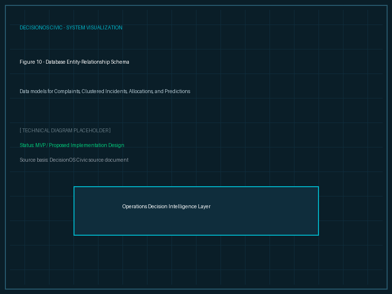
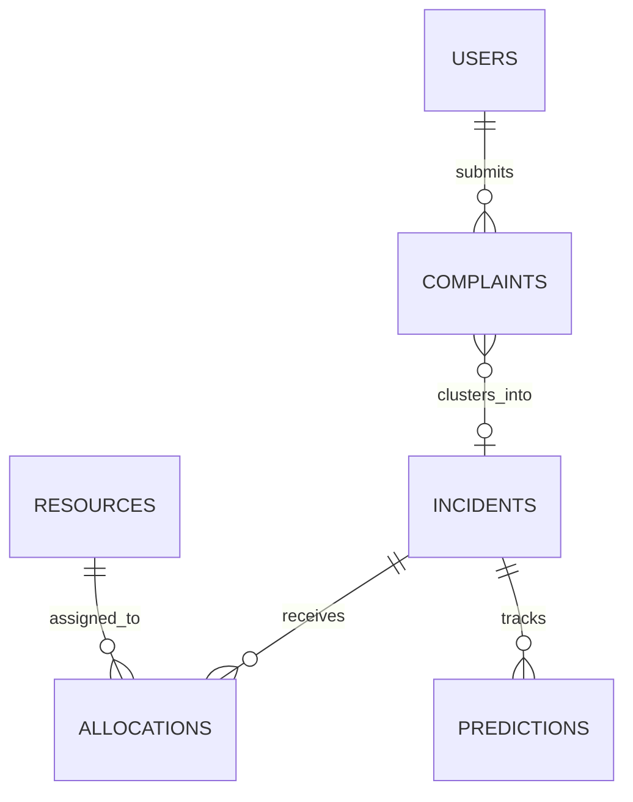

# Entity Relationships

## Purpose
This document visualizes the relationships between database tables.

## Content
### Entity Relationship Schema

*Figure 10. Entity-Relationship diagram showing the connection between Complaints, Incidents, Allocations, and Predictions.*

### ER Diagram (Mermaid Format)

## Related Documents
- [Data Model](02-data-model.md)
- [Database Overview](01-database-overview.md)
