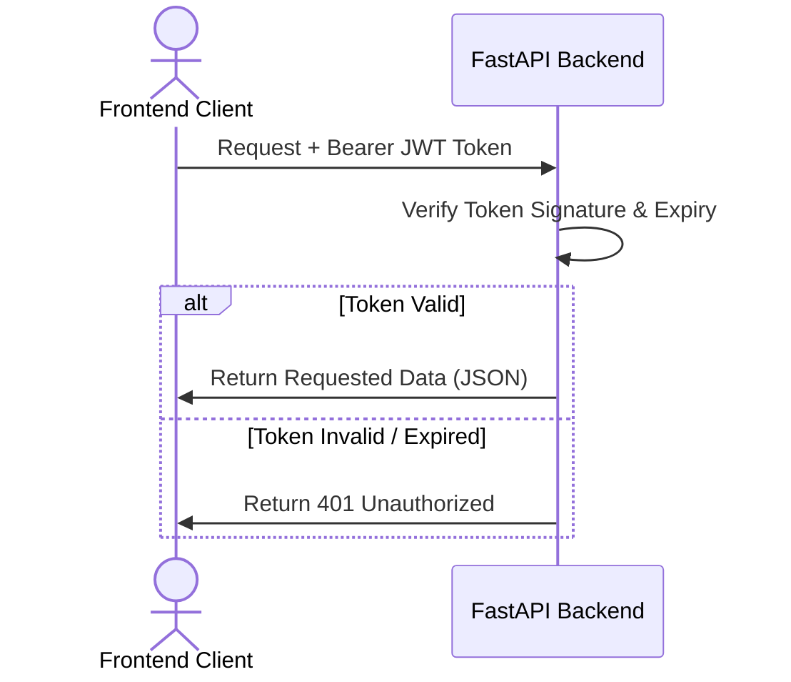

# API Overview

## Purpose
This document presents the API design guidelines for the DecisionOS Civic services.

## Content
### Protocol Specification
- **Base Format**: JSON REST API.
- **Authentication**: JWT token inside HTTP headers (`Authorization: Bearer <token>`).
- **Base Endpoint**: `/api/v1`

### Authentication Flow

## Related Documents
- [Authentication API](02-authentication.md)
- [Complaint API](03-complaint-api.md)
