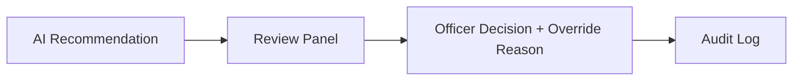

# Responsible AI & Human-in-the-loop

## Purpose
This document explains the ethical safeguards and human controls built into the platform.

## Content
### Mandatory Safeguard
**DecisionOS Civic must not automatically approve dispatches or operational expenditures.**

### Audit Logging
Every action must record:
- `WHO`: The officer email.
- `WHAT`: Approval or override command.
- `WHEN`: Timestamp.
- `WHY`: Required text explanation for overrides.

This guarantees complete traceability for judicial or administrative reviews.

## Related Documents
- [Explainable AI](../06-ai-ml/13-explainable-ai.md)
- [Security Overview](01-security-overview.md)
