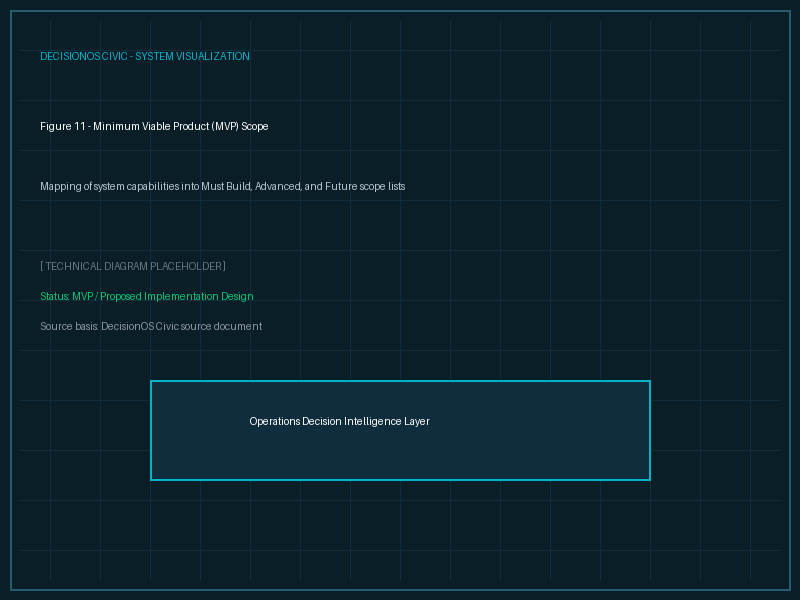

# MVP Scope

## Purpose
This document defines the boundary of the Minimum Viable Product (MVP).

## Content
### MVP Boundaries
To prevent scope creep, the MVP focuses on a single, complete end-to-end loop:

```
[Citizen Road Damage Complaint] ──► [YOLO Detection] ──► [Priority Score] ──► [OR-Tools Dispatch]
```

### Scope Divisions

#### Must Build (MVP)
- Citizen PWA submission form (Photo + GPS).
- Multimodal similarity engine (duplicate detection).
- Basic Integer Linear Programming resource solver.
- Officer Approve/Override dashboard.

#### Advanced / Optional
- What-if simulation engine.
- High-capacity LSTM risk forecasting.
- SHAP feature explainers.

#### Future
- Automated UMANG/CPGRAMS sync.
- Real-time IoT sensor network feeds.


*Figure 11. MVP scope mapping, highlighting must-build elements vs advanced and future features.*

## Related Documents
- [Development Roadmap](02-development-roadmap.md)
- [Future Scope](05-future-scope.md)
