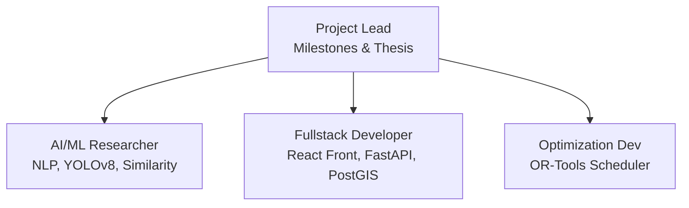

# Team Responsibilities

## Purpose
This document provides placeholders for team responsibilities.

## Content
### Team Organization (Status: Proposed)
- **AI/ML Researcher**: Focuses on NLP fine-tuning, CV object detection, and similarity calculations.
- **Fullstack Software Engineer**: Handles FastAPI endpoints, React dashboard components, and PostGIS queries.
- **Optimization Specialist**: Formulates operations research constraints and integrates OR-Tools.
- **Project Lead**: Manages milestones, documentation indexing, and academic writing.

### Organization Chart

## Related Documents
- [Development Roadmap](02-development-roadmap.md)
- [Deliverables](../17-project-management/02-deliverables.md)
