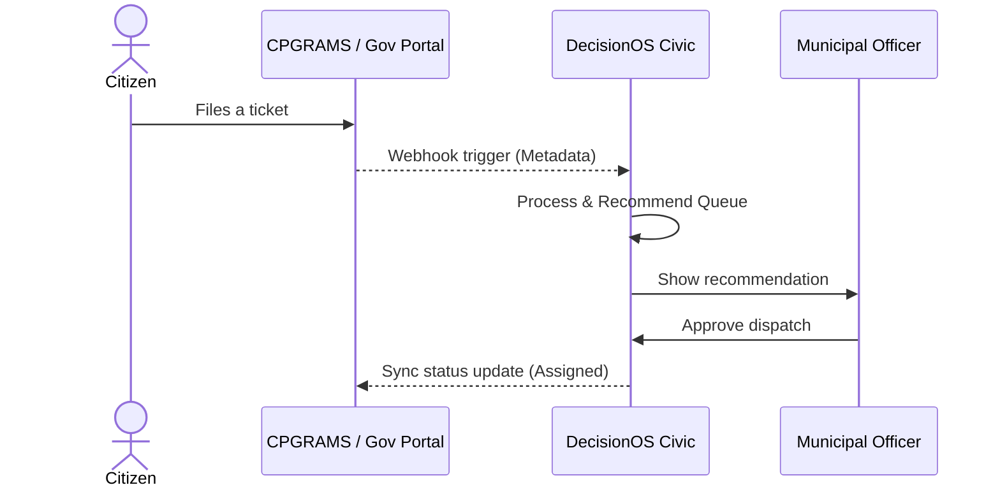

# Government Integration

## Purpose
This document details integration constraints with official platforms.

## Content
### Feasibility Constraints
Integrating with live systems (like CPGRAMS) requires institutional approval and API keys. To ensure feasibility, DecisionOS operates under **Mode A (Academic Mode)** which requires no credentials.

### Production Pipeline (Mode B)
If credentials are approved:
1. Citizen files ticket on CPGRAMS.
2. CPGRAMS fires Webhook to DecisionOS Integration Gateway.
3. DecisionOS recomputes queue recommendations.
4. Officer approves recommendation, sending status update back to CPGRAMS.

### Mode B Integration Flowchart

## Related Documents
- [Integration Gateway](02-integration-gateway.md)
- [Proposed Solution](../03-solution/01-proposed-solution.md)
