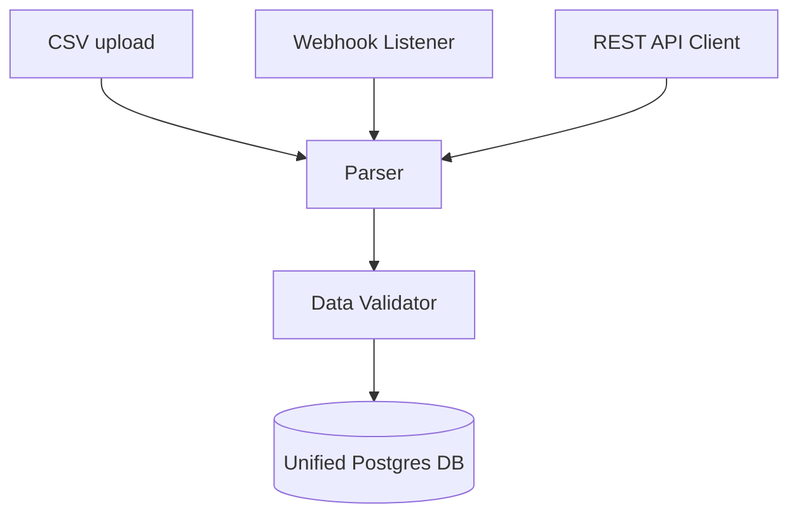

# Integration Gateway

## Purpose
This document describes the structure of the integration gateway.

## Content
### Architecture & Formats
The gateway parses multiple formats:

### Adapter Schemas
- **Adapter 1**: CSV -> DecisionOS
- **Adapter 2**: REST API -> DecisionOS
- **Adapter 3**: Webhook -> DecisionOS
- **Adapter 4**: Database Sync (PostgreSQL/MySQL) -> DecisionOS

This guarantees the platform remains system-agnostic.

## Related Documents
- [Government Integration](01-government-integration.md)
- [API Overview](../11-api/01-api-overview.md)
