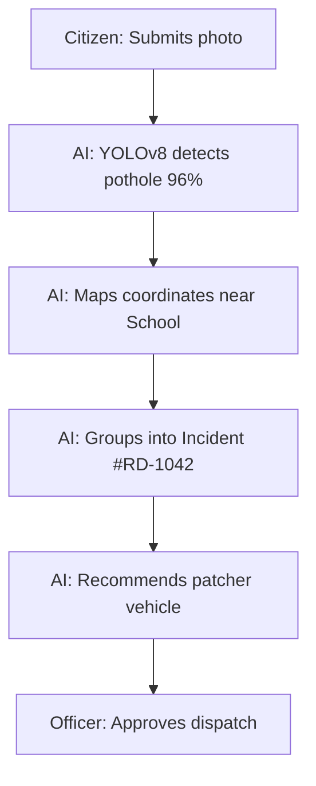

# Road Damage Use Case

## Purpose
This document details a road damage incident resolution.

## Content
### Workflow
1. Citizen submits photo of a deep pothole.
2. YOLO model detects pothole (96% confidence).
3. The location maps near ABC School (High Severity).
4. System groups it into existing incident cluster `#RD-1042`.
5. Solver assigns the nearest patching vehicle.
6. Dispatch updates.

### Road Damage Workflow

## Related Documents
- [End-to-End Use Case](01-end-to-end-use-case.md)
- [Road Damage Domain](../08-domains/02-road-damage.md)
