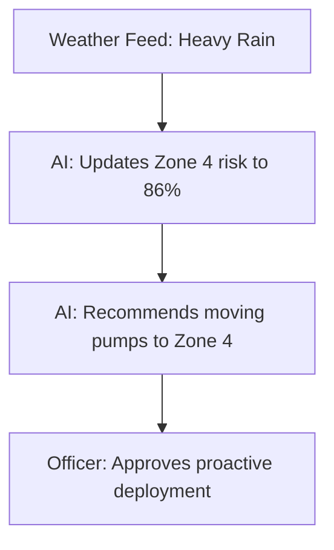

# Flood Risk Use Case

## Purpose
This document details a flood risk mitigation use case.

## Content
1. Weather feed reports heavy monsoon rainfall forecasts.
2. Predictive risk model updates: Zone 4 flood probability rises from 72% to 86%.
3. System suggests moving emergency drainage pumps to Zone 4.
4. Officer approves; equipment is redeployed proactively.

### Flood Mitigation Workflow

## Related Documents
- [End-to-End Use Case](01-end-to-end-use-case.md)
- [Flood Risk Domain](../08-domains/05-flood-risk.md)
