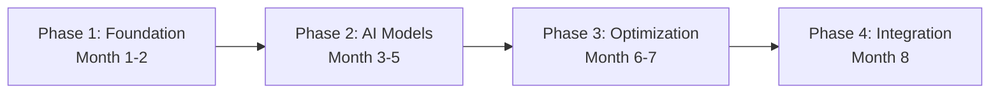

# Project Phases

## Purpose
This document outlines the milestones of the project lifecycle.

## Content
### Milestones
- **Phase 1 (Month 1-2)**: System architecture selection, PostgreSQL database configuration, API initialization.
- **Phase 2 (Month 3-5)**: NLP & CV model training, duplicate similarity solver validation.
- **Phase 3 (Month 6-7)**: Optimization algorithm implementations (OR-Tools vs greedy).
- **Phase 4 (Month 8)**: System integration checks, deployment scripts, final presentation.

### Project Phase Transitions

## Related Documents
- [Development Roadmap](../14-implementation/02-development-roadmap.md)
- [Deliverables](02-deliverables.md)
